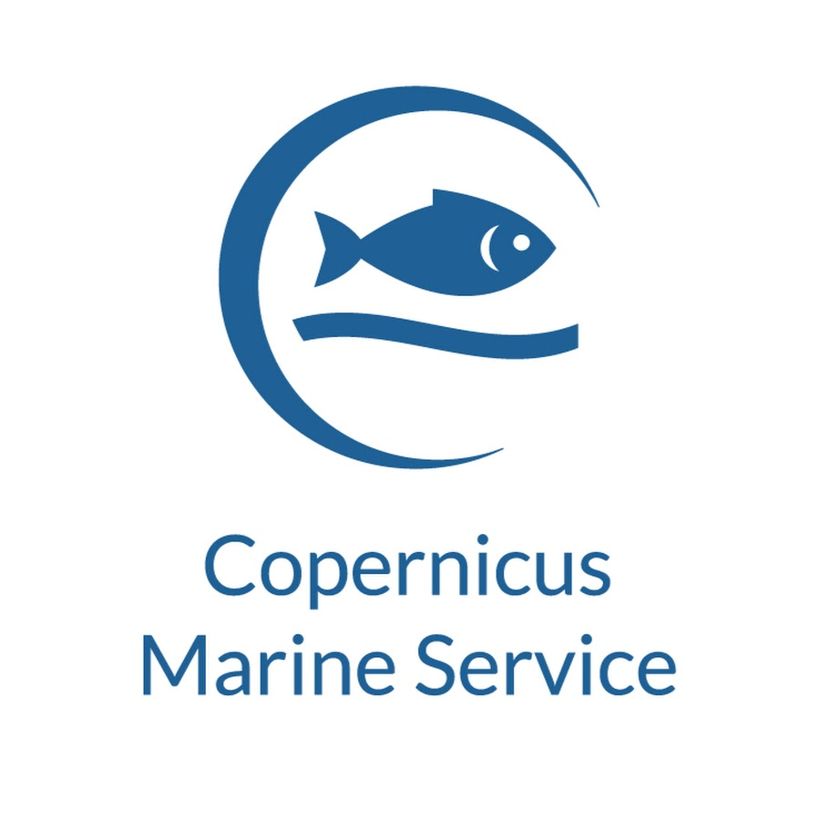
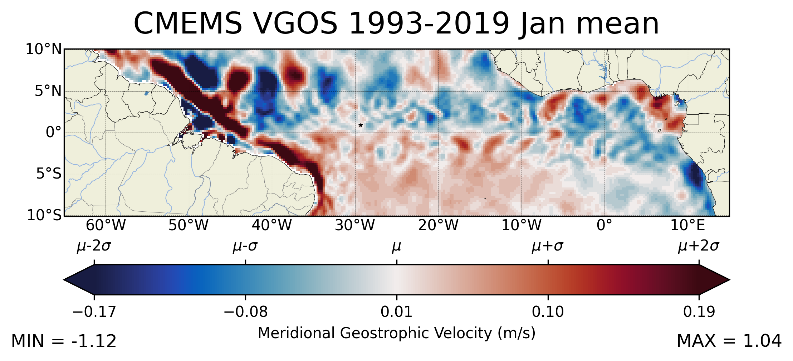

# CMEMS_altimetry
 

- Python 3.8.13
	- Numpy 1.20.3
	- Seaborn 0.11.2
	- Matplotlib 3.5.3
	- Xarray 2022.10.0
	- Dask 2021.09
	- Cartopy 0.21.0
	- Cmocean 2.0

The Copernicus Marine Environment Monitoring Service (CMEMS), implemented and operated by Mercator Ocean, provides oceanographic products and services for maritime safety, coastal and marine environment, climate and weather forecasting and marine resources users.

 
In this project I've created some functions to help plot global monthly climatologies of zonal and meridional geostrophic velocities. The absolute dynamic topography variable was used to construct hovmöller diagrams in latitudes with strong signals in the low-frequency energy spectrum. Rossby waves can then be visualized in this format

There is also some snippets to plot "zoomed-in" data in a regular lat-long cartesian projection. Even before the identification of planetary waves by FIR-2D filtering, the monthly climatology of meridional geostrophic velocities already betrays their existence as chains of crests and throughs (e.g. around 5ºN):

The star marks the location of the St. Peter & St. Paul archipelago

 
It uses dask to optimize the code run (as opening these many netcdf files in nested concatenation is not a trivial task). Even less trivial is performing the chronological
mean for the monthly climatology. Big kudos to those who created this awesome tool.
 
Finally, it also spits out Hovmoller diagrams for each of the latitudes of interest, since they are useful for identifying meso and large-scale phenomena such as vortices and planetary (Rossby/Equatorial Kelvin) waves.
 
I managed to do some neat animations with matplotlib and cartopy!

