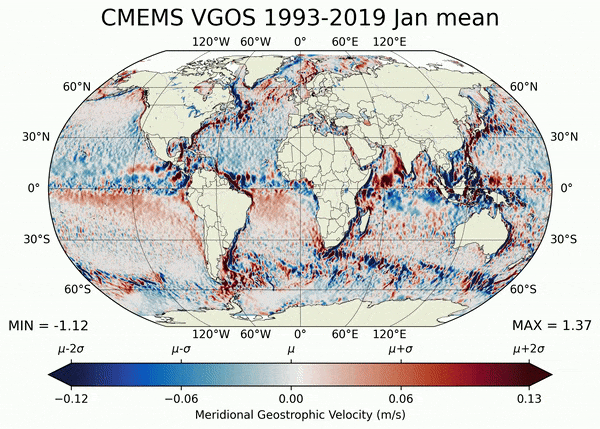
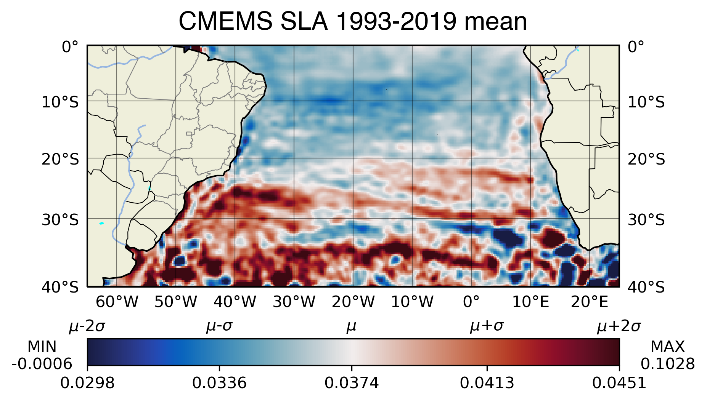
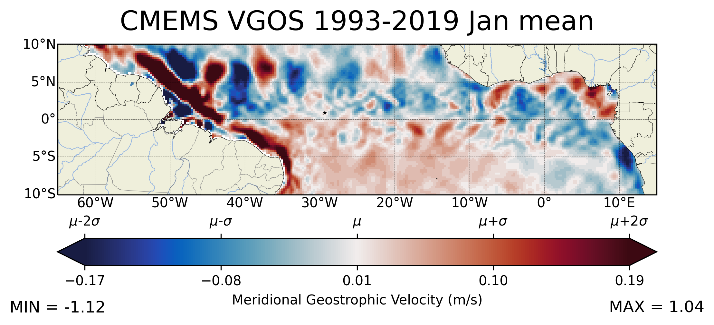
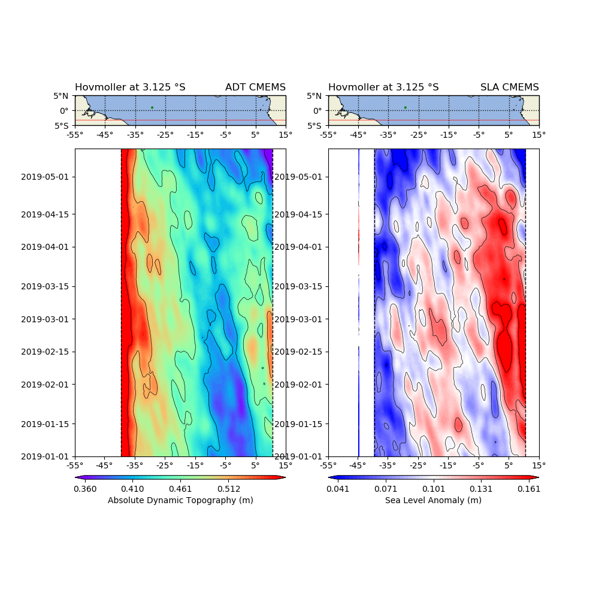

# CMEMS_altimetry
 

Project status: In Progress

- Python 3.8.13
	- Numpy 1.20.3
	- Seaborn 0.11.2
	- Matplotlib 3.5.3
	- Xarray 2022.10.0
	- Dask 2021.09
	- Cartopy 0.21.0
	- Cmocean 2.0

The Copernicus Marine Environment Monitoring Service (CMEMS), implemented and operated by Mercator Ocean, provides oceanographic products and services for maritime safety, coastal and marine environment, climate and weather forecasting and marine resources users.

---

In this project I've created some functions to help plot global monthly climatologies of zonal and meridional geostrophic velocities such as this one: 

The sea-level anomaly derived from the absolute dynamic topography variable was used to construct hovmöller diagrams in latitudes with strong signals in the low-frequency energy spectrum, such as the Brazil-Malvinas confluence identified below through a climatology of the full series on the South Atlantic ocean:

There are also some snippets to plot "zoomed-in" data in a regular lat-long cartesian projection. Even before the identification of planetary waves by FIR-2D filtering, the monthly climatology of meridional geostrophic velocities already betrays their existence as chains of crests and throughs (e.g. around 5ºN):

The star marks the location of the St. Peter & St. Paul archipelago

 
It uses dask to optimize the code run (as opening these many netcdf files in nested concatenation is not a trivial task). Even less trivial is performing the chronological
mean for the monthly climatology. Big kudos to those who created this awesome tool.
 
Finally, it also spits out Hovmoller diagrams for each of the latitudes of interest, since they are useful for identifying meso and large-scale phenomena such as vortices and planetary (Rossby/Equatorial Kelvin) waves.
 

## Physical background

The austral ocean currently acumulates more heat and anthropogenic carbon than any other oceanic region (Speer, 2012). Due to the oceans's large heat capacity, the superficial circulation can influence climate variability primarily
on interannual and decadal scales (Talley, 1999; Dewar et al., 2001; Pierce, 2001). Climate models suggest that the variability of mass, salt and heat transports are related to significative changes on precipitation patterns,
hurricane intensification and global sea level rise (Goddard, 2015).

On the South Atlantic, transports of mass, salt and heat are dictated by the Meridional Overturning Circulation, whose dynamics is still not fully understood. By redistributing heat between the ocean basins and the atmosphere,
the MOC affects the global climate. Its variability is spread on different timescales (Eden, 2001; Kanzow, 2010). The Atlantic portion of the MOC (AMOC) is considered one of the main tipping elements of the Earth system
(Lenton et al., 2008), since it's a highly nonlinear system driven by subtle changes in temperature and salinity (hence the name "Thermohaline circulation" describes the parcel of the MOC driven by density fluxes).
Indeed, studies have suggested that the AMOC might have triggered rapid climate variation on the geological past. Therefore, on the context of climate change, it would be ideal to discriminate between the MOC's natural variability
and the variability imposed by anthropogenic forcings. A number of studies have observed a recent decline of MOC (reviewed in Robson, 2012).

